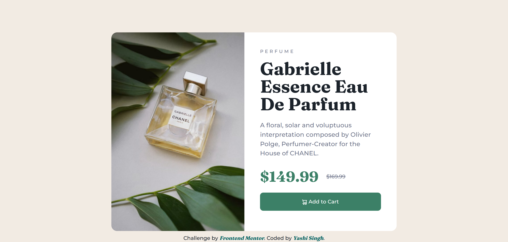
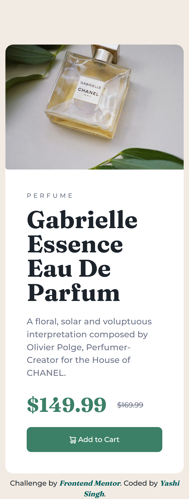

# Frontend Mentor - Product Preview Card Component Solution

This is a solution to the [Product Preview Card Component challenge on Frontend Mentor](https://www.frontendmentor.io/challenges/product-preview-card-component-GO7UmttRfa). Frontend Mentor challenges help you improve your coding skills by building realistic projects.

## Table of contents

- [Overview](#overview)
  - [The Challenge](#the-challenge)
  - [Screenshot](#screenshot)
  - [Links](#links)
- [My Process](#my-process)
  - [Built With](#built-with)
  - [What I Learned](#what-i-learned)
  - [Continued Development](#continued-development)
  - [Useful Resources](#useful-resources)
- [Style Guide](#style-guide)
- [Author](#author)
- [Acknowledgments](#acknowledgments)

## Overview

### The Challenge

Users should be able to:

- View the optimal layout depending on their device's screen size
- See hover and focus states for interactive elements

### Screenshot

### Links

- Live Site URL: [Live Demo](https://product-preview-card-compnent.netlify.app/)

## My Process

### Built With

-  Semantic HTML5 markup
-  CSS custom properties
-  Flexbox
- Mobile-first workflow
-  [Montserrat](https://fonts.google.com/specimen/Montserrat) - Font used for headings and buttons
-  [Fraunces](https://fonts.google.com/specimen/Fraunces) - Font used for product name and price

### What I Learned

Working on this project, I enhanced my skills in:

-  Using CSS Flexbox to create a responsive layout that adjusts to different screen sizes.
- Managing font styles and incorporating custom fonts into a project.
- Ensuring accessibility by adding meaningful aria-labels to interactive elements.

### Continued Development

In future projects, I plan to focus on:

- Improving my knowledge of advanced CSS techniques, such as animations and transitions.
- Exploring more about responsive design and media queries to handle various screen sizes and orientations.
- Enhancing my JavaScript skills to add interactivity and dynamic behavior to my components.

### Useful Resources

- [CSS Tricks Flexbox Guide](https://css-tricks.com/snippets/css/a-guide-to-flexbox/) - A comprehensive guide to Flexbox.
- [MDN Web Docs](https://developer.mozilla.org/en-US/) - A valuable resource for HTML, CSS, and JavaScript documentation.
- [Google Fonts](https://fonts.google.com/) - For selecting and integrating web fonts.

## Style Guide

For style guidelines, check out my [Style Guide](Style-Guide.md).

## Author

- Frontend Mentor -  [@Yashi-Singh-1](https://www.frontendmentor.io/profile/Yashi-Singh-1)
- LinkedIn -  [@Yashi-Singh](https://www.linkedin.com/in/yashi-singh-b4143a246)

## Acknowledgments

Thank you to the Frontend Mentor community for the challenge and the inspiration. Special thanks to  [@frontendmentor](https://www.frontendmentor.io/) for creating such valuable resources to improve web development skills.
